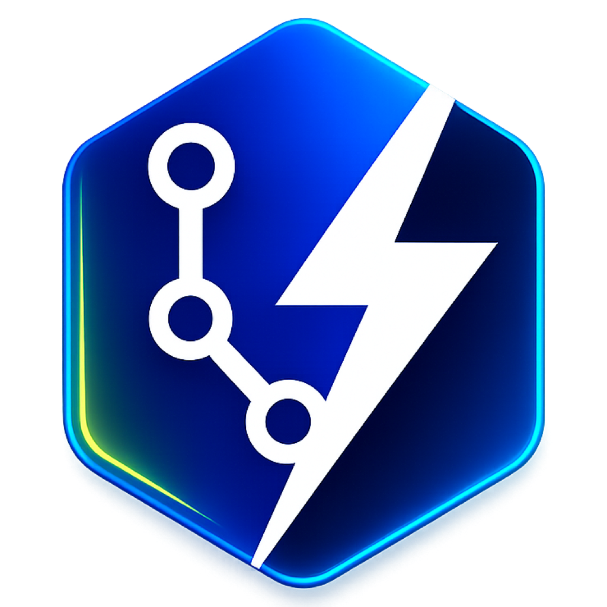
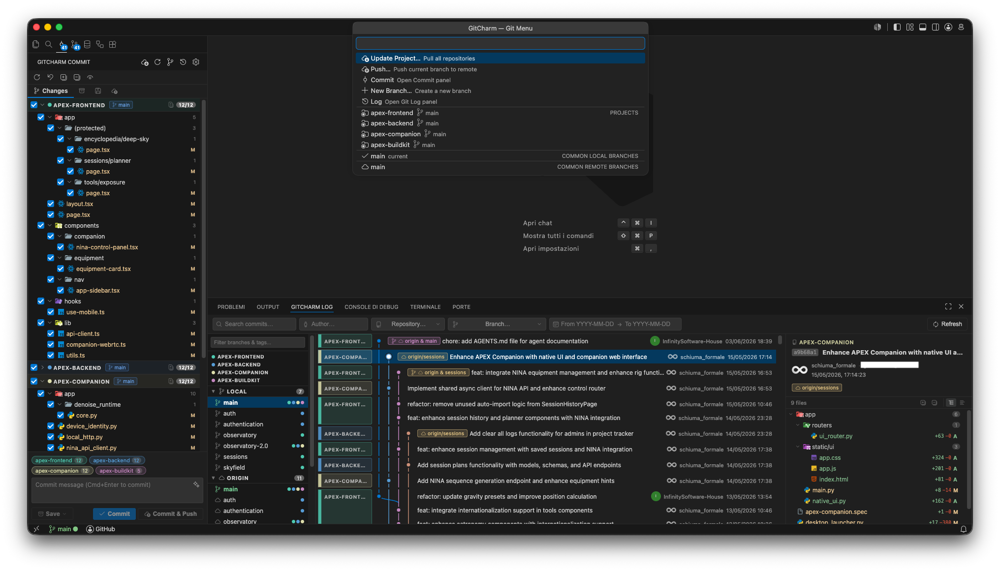
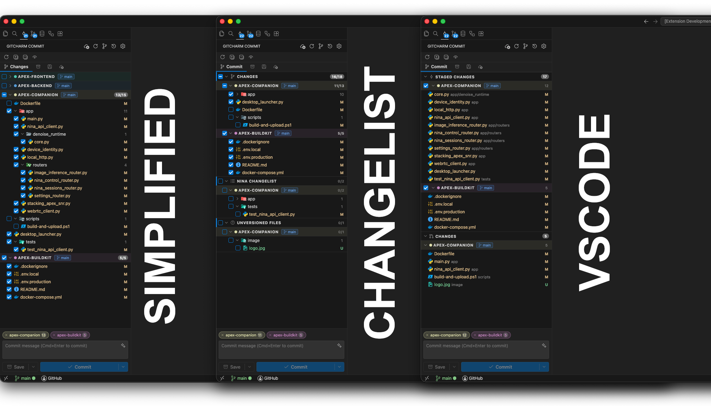
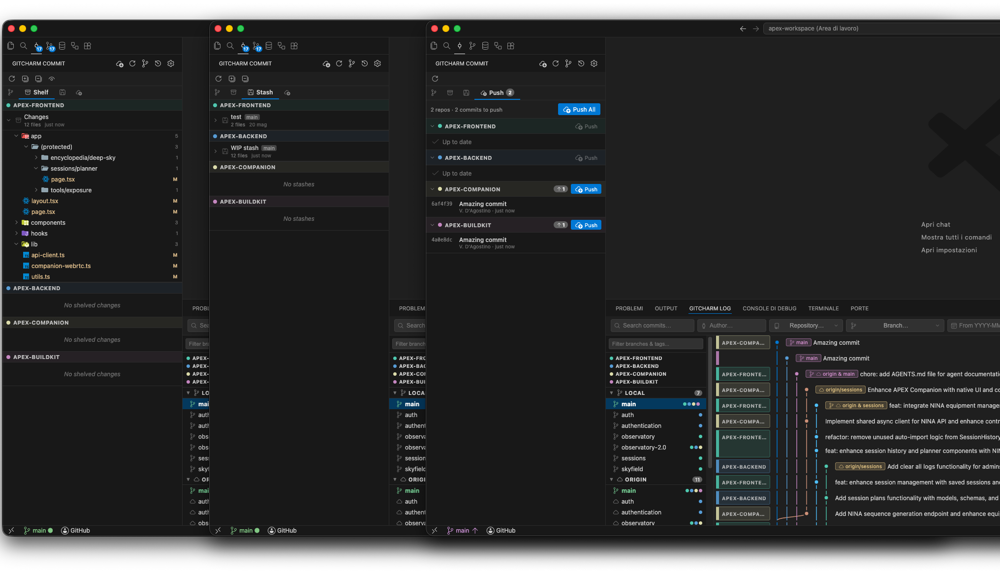
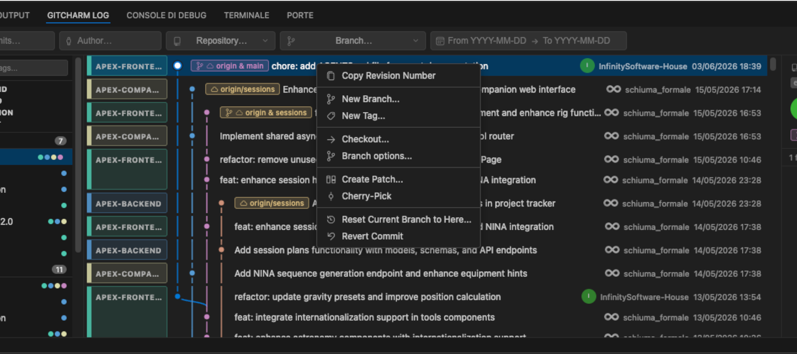
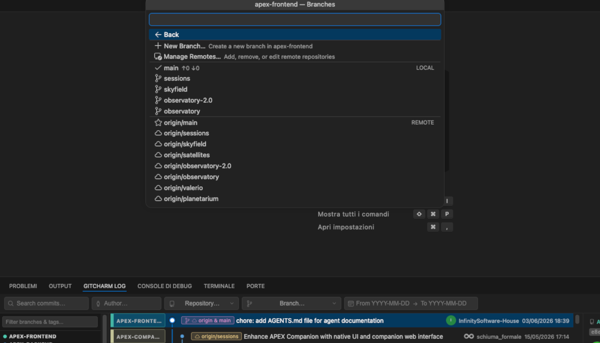
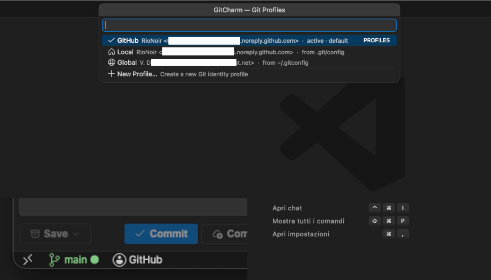
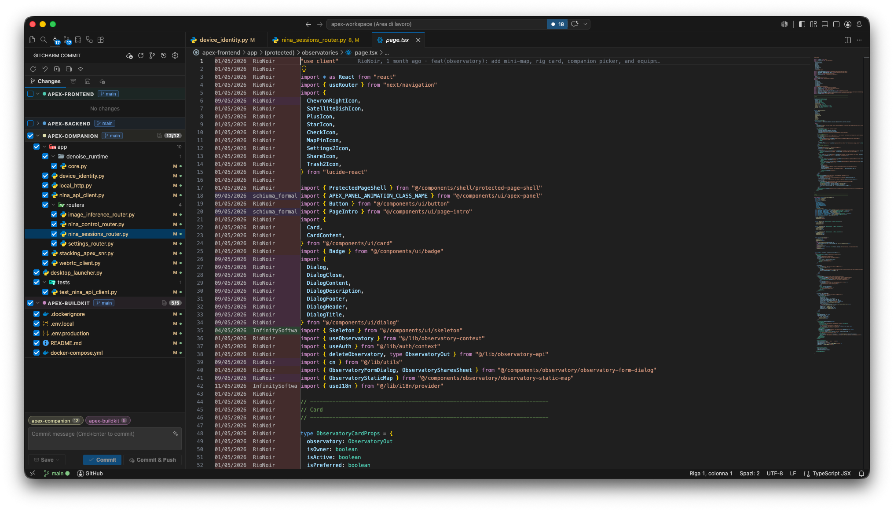

<p align="center">
  
</p>

<h1 align="center">VersionDock</h1>

<p align="center">
  A focused Git and SVN workbench for VS Code.
</p>

<p align="center">
  
  
  
</p>

VersionDock brings an IDE-style VCS workflow to Visual Studio Code: a focused Commit panel, a Git Log panel with graph and branch operations for Git, SVN revision history, multi-repository awareness, shelving/stashing tools for Git, push helpers, and a 3-way merge editor for conflict resolution.

It activates automatically when the opened workspace contains a Git repository or an SVN working copy.



## ✨ Features

### 📝 Commit Panel

- Staged/unstaged file list with tree and flat views (persisted across reloads).
- Per-file diff preview directly in the panel.
- Per-file actions: open, rollback, delete, add to `.gitignore`.
- Commit selected files only, or all staged changes.
- SVN working copies use selected files as the commit target because SVN has no Git-style index.
- **Commit** and **Commit & Push** unified dropdown button; **Amend** and **Amend & Push** via the dropdown.
- Built-in AI commit-message generation for GitHub Copilot, OpenAI, Claude, Gemini, and custom OpenAI-compatible endpoints.
- Generated messages stream into the commit box with a typewriter effect and use the same editable Commit Prompt for every provider.
- Commit message pre-filled automatically with `Merge branch 'X' into 'Y'` when merge conflicts are detected.
- New and modified files are **not** automatically selected — only files that were already selected before the change are preserved.

#### View Modes

On first install, a QuickPick lets you choose your preferred view mode. You can change it at any time via `versiondock.changesViewMode` in Settings.

| Mode | Description |
|:--|:--|
| **Simplified** | Staged and Unstaged sections grouped per repository (default) |
| **Changelists** | PhpStorm-style named changelists; files can be moved between lists |
| **VS Code** | Native-style Staged Changes / Changes sections with inline stage/unstage buttons |



#### Changelists

- Create, rename, and delete named changelists from the context menu.
- Drag files between changelists or use the context menu to reassign them.
- Default changelist and Unversioned Files list are always present.

#### Repository pills & commit targeting

- The commit message area shows a pill for each repository with staged/selected files.
- Click the **×** on a pill to quickly deselect that repository from the commit.
- In VS Code mode, a per-repository checkbox in the Staged Changes section controls which repositories are included.

### 🚀 Push Tab

- Lists unpushed commits for every repository, including branches without an upstream tracking branch.
- Commit count badge on the tab label, auto-updated after each commit, undo, or push.
- **Undo** the HEAD commit (with confirmation) directly from the push list.
- Click any row to jump to that commit in the Git Log panel.
- **Publish** button for branches that have never been pushed.
- Silent refresh: existing commits stay visible while reloading (no flicker).

### 🗄️ Shelve & Stash

- **Shelve** with patch-based shelves: create, apply (full or partial), delete, and inspect per-file diffs.
- Binary-file handling and conflict detection on unshelve.
- **Native stash** support: list, apply, pop, drop, and file diff preview.



### 📜 Git Log Panel

- Commit graph with branch visualization.
- SVN working copies show linear revision history with revision number, author, date, message, changed paths, and per-file diffs.
- Branch sidebar: local branches, remote branches, tags; single-repo workspaces hide the repository list.
- Filters by text, author, branch, date, and repository.
- Commit detail with changed-file list and per-file diffs.
- Extended single-commit and aggregate-commit detail pages can explain historical Git/SVN changes with AI, including streamed typewriter output, cancellation, and explicit truncation notices for oversized diffs.
- Click a commit title to expand/collapse the message; if the commit has a body, it opens as a Markdown document in a VS Code tab.
- Author avatars in commit rows and commit detail: resolves GitHub noreply emails to GitHub avatars, other emails to Gravatar, with a colored-initials fallback.
- Branch operations from the sidebar: checkout, fetch, pull, push, merge, rebase, delete, rename, compare, and create new branch.
- **Tags section** in the sidebar: collapsible list with multi-repo dot indicators; tags with the same name across repos are merged into a single row; active tag highlighted when in detached HEAD state.
- Tag context menu: checkout, merge into current, push to remote, and delete (local, remote, or both).
- Commit context menu: **New Tag…** when the commit has no tags; **Manage Tags…** (QuickPick with merge/delete actions) when it does.
- **Checkout…** in the commit context menu: QuickPick lets you choose between checking out the branch or the revision (detached HEAD); works for remote-only branches too.
- **Branch options…** in the commit context menu: opens the Git Menu focused on that branch.
- Log Panel auto-refreshes in the background after a commit or push, with a loading skeleton during the fetch.
- Hides `origin/HEAD` from the remote branches list.

<br>


### 🌿 Branch Status Bar

- Shows the current branch name (truncated with ellipsis if long) with dirty, ahead, behind, and diverged states; shows the short commit hash when in detached HEAD state without a tag, or the tag name when checked out on a tag.
- **Branch menu** with quick access to: update project, push, commit, branch operations, and log.
- SVN working copies show the current trunk/branch/tag or repository-relative URL and provide update, commit, cleanup, switch, branch, and tag actions.
- **Tags section** in the per-repository menu: checkout, merge, push to remote, and delete tags; delete dialog offers three options (local, remote, or both).
- **Per-repository sub-menu** with full remote management: add, rename, change URL, and remove remotes.
- Tracks the active editor to reflect the correct repository in multi-repo workspaces.

<br>


### 👤 Version Control Accounts

- Context-aware status bar account entry: Git repositories open the Git identity manager, while SVN working copies open SVN authentication management.
- Named Git identity profiles (display name, `git user.name`, `git user.email`) are reusable across workspaces, with the active selection stored per workspace.
- Fallback chain: active VersionDock profile → Local (repo `.git/config`) → Global (`git config --global`).
- Set **Local** or **Global** as the default source per workspace without creating a named profile.
- Reserved names `Local` and `Global` are displayed as implicit entries with source tooltip.
- Active named profiles are injected only into commits made by VersionDock and do not rewrite `.git/config` or `~/.gitconfig`.
- SVN account menus show the repository URL, detected username and credential source, and provide account switching, session credential reset, native SVN cache cleanup, and connection testing.
- Mixed Git/SVN roots expose the Git identity and SVN account as separate entries.

<br>


### 🔍 Git Annotations (Blame)

- Inline blame columns in the editor showing commit author, relative date, and summary.
- Ghost text with the same information rendered at the end of the current line.
- Hover actions link directly to the commit in the Git Log panel.
- Accessible via editor context menu and Command Palette; toggled with dedicated commands.
- Layout adapts around edits, tabs, CodeLens, and editor alignment.

<br>


### 🗂️ Multi-Repository Workspaces

- Per-project colors in the commit graph and commit panel.
- Grouped changes and a shared commit flow across repositories.
- Common branch actions applied across all repositories in one step.
- Activity bar badge showing the total number of changed files across all repositories.
- Supports project folders that contain multiple child repositories, including mixed Git/SVN layouts such as a root Git project with `api/`, `admin/`, and `app/` SVN working copies.
- Nested child repositories own their files in the Commit panel, so parent repositories do not duplicate changes from child VCS roots.

### 🧩 SVN Working Copies

- Detects SVN 1.7+ working-copy roots through `.svn`; folders containing both `.git` and `.svn` are registered as separate Git and SVN repository instances.
- Status support for modified, added, deleted, missing, unversioned, and conflicted files.
- Diff support for working-copy changes and historical revisions through `svn diff`.
- Commit selected files with `svn commit --targets`, including automatic `svn add` for selected unversioned files.
- Update, revert, cleanup, resolve as working, lock, and unlock commands.
- Branch and tag support for the conventional `/trunk`, `/branches/*`, and `/tags/*` repository layout through `svn switch` and `svn copy`.

### ⚔️ Merge Editor

- 3-way conflict editor for files containing Git conflict markers.
- Side-by-side conflict panes with editable result.
- Conflict navigation, save, and automatic staging on completion.

## 📋 Requirements

- Visual Studio Code `1.85.0` or newer.
- Git installed and available in the workspace.
- SVN support requires a local `svn` CLI in `PATH` for SVN working copies. The current implementation has been validated against SVN `1.14.5`.
- Node.js `18` or newer and npm for development or packaging.

VersionDock uses VS Code's built-in Git extension when available and falls back to direct Git operations through `simple-git`.
SVN commands are executed through the local `svn` executable; no SVN npm runtime dependency is bundled.

## 📦 Installation

### From a VSIX

Build and package the extension:

```bash
npm install
npm run build
npm run package
```

Then install the generated `.vsix`:

```bash
code --install-extension versiondock-1.1.0.vsix
```

### Development Host

Install dependencies, build once, then launch the extension host from VS Code:

```bash
npm install
npm run build
```

Open this repository in VS Code and run **Run Extension** from the Debug panel.

For iterative development:

```bash
npm run watch
```

## 🛠️ Usage

Open a workspace that contains one or more Git repositories or SVN working copies. VersionDock adds:

- **VersionDock Commit** in the Activity Bar.
- **VersionDock Log** in the bottom Panel.
- A **branch item** and a **profile item** in the Status Bar.
- Commands in the Command Palette.

Use the Commit panel to select files, inspect diffs, write a commit message, commit, commit and push Git changes, shelve Git changes, manage Git stashes, or review unpushed Git commits. For SVN, selected files are committed directly to the server.

The default AI provider is `github-copilot`. Select `openai`, `claude`, `gemini`, or `custom` to configure an API URL, model, and key.

Use **VersionDock: Edit Commit Prompt** to customize formatting. A workspace prompt is stored at `.vscode/ai-commit-message.prompt.md`; the global prompt is stored in VersionDock's global extension storage. Workspace prompts take precedence when all selected repositories belong to one workspace, followed by the global prompt and the built-in default.

Open an extended commit detail page and select **AI Explain** to generate a structured explanation from commit metadata and historical diffs. Use **VersionDock: Edit Commit Explanation Prompt** to customize the explanation. Its workspace prompt is stored at `.vscode/ai-commit-explanation.prompt.md`; the workspace, global, and built-in precedence matches the commit-message prompt. Explanations stay in the current detail page and are not cached on disk.

Use the Log panel to browse history, filter commits or SVN revisions, inspect changed files, open diffs, and run supported branch or revision operations.

Use the Status Bar branch menu for fast project-wide actions such as updating all repositories, pushing Git repositories, creating branches, switching branches, managing remotes, SVN cleanup, or handling merge/rebase states.

## ⌨️ Commands

| Command | Description |
|:--|:--|
| `VersionDock: Focus Git Log` | Focuses the Git Log panel. |
| `VersionDock: Fetch All Remotes` | Fetches and prunes all remotes. |
| `VersionDock: Open Merge Editor` | Opens the merge editor for the active file when conflict markers are present. |
| `VersionDock: Refresh Commit Panel` | Refreshes the Commit panel state. |
| `VersionDock: Branch Menu` | Opens the Status Bar branch menu. |
| `VersionDock: Update Project` | Pulls all repositories using merge or rebase. |
| `VersionDock: Settings` | Opens VersionDock settings. |
| `VersionDock: Edit Commit Prompt` | Edits the workspace or global prompt used by every AI provider. |
| `VersionDock: Reset Commit Prompt` | Removes a workspace or global custom prompt. |
| `VersionDock: Edit Commit Explanation Prompt` | Edits the workspace or global prompt used for AI commit explanations. |
| `VersionDock: Reset Commit Explanation Prompt` | Removes a workspace or global custom commit-explanation prompt. |
| `VersionDock: Manage Version Control Accounts` | Opens the context-aware Git identity or SVN account manager. |
| `VersionDock: Switch Git Profile` | Switches the active Git profile for the current workspace. |
| `VersionDock: SVN Cleanup` | Runs `svn cleanup` for an SVN working copy. |
| `VersionDock: SVN Resolve as Working` | Marks the selected SVN conflicted file as resolved with the working copy content. |
| `VersionDock: SVN Lock` | Locks the selected SVN file, with an optional lock message. |
| `VersionDock: SVN Unlock` | Unlocks the selected SVN file. |
| `VersionDock: SVN Switch` | Switches an SVN working copy to trunk, a branch, or a tag. |
| `VersionDock: SVN Create Branch` | Creates an SVN branch under `/branches`. |
| `VersionDock: SVN Create Tag` | Creates an SVN tag under `/tags`. |
| `Open Git Annotations` | Shows inline blame annotations in the active editor. |
| `Close Git Annotations` | Hides inline blame annotations in the active editor. |
| `VersionDock: Navigate to Commit` | Navigates to the commit linked from a blame annotation. |

## ⌨️ Keybindings

| Keybinding | macOS | Command |
|:--|:--|:--|
| `Ctrl+Alt+L` | `Cmd+Alt+L` | `VersionDock: Focus Git Log` |
| `Ctrl+Alt+K` | `Cmd+Alt+K` | `VersionDock: Commit` |

## ⚙️ Settings

| Setting | Default | Description |
|:--|:--|:--|
| `versiondock.graphMaxCommits` | `1000` | Maximum number of commits loaded into the Git Log graph. |
| `versiondock.fetchOnStartup` | `false` | Fetches all remotes when VersionDock activates. |
| `versiondock.projectColors` | `{}` | Maps workspace folder/repository names to hex colors for multi-repo views. |
| `versiondock.repositoryScanMaxDepth` | `1` | Maximum depth of workspace subfolders to scan for Git repositories. `0` only checks workspace folders. |
| `versiondock.repositoryScanIgnoredFolders` | `["node_modules"]` | Folder names or workspace-relative paths skipped while scanning for nested Git repositories. |
| `versiondock.autoRefreshInterval` | `0` | Auto-refresh interval in seconds. `0` disables interval refresh and uses file watchers only. |
| `versiondock.changesViewMode` | `"simplified"` | How to display changed files: `simplified`, `changelists`, or `vscode`. Chosen via QuickPick on first install. |
| `versiondock.gitAnnotations.enabled` | `true` | Enable inline Git blame annotations in the editor. |
| `versiondock.gitGhostText.enabled` | `true` | Enable inline Git ghost text in the editor. |
| `versiondock.ai.provider` | `"github-copilot"` | AI provider: `github-copilot`, `openai`, `claude`, `gemini`, or `custom`. |
| `versiondock.ai.model` | `""` | Model name. GitHub Copilot selects a model automatically when empty. |
| `versiondock.ai.apiUrl` | `""` | Endpoint URL required by non-Copilot providers. |
| `versiondock.ai.apiKey` | `""` | API key required by non-Copilot providers. |

Example:

```json
{
  "versiondock.fetchOnStartup": true,
  "versiondock.graphMaxCommits": 2000,
  "versiondock.projectColors": {
    "api": "#ff6b6b",
    "web": "#4ec9b0"
  },
  "versiondock.gitAnnotations.enabled": true
}
```

## 🏗️ Project Structure

```text
src/host/                 VS Code extension host code
src/host/git/             Git, diff, conflict, blame, workspace, and shelve services
src/host/svn/             SVN CLI adapter and status/log/diff parsing
src/host/vcs/             Shared VCS types and CLI helpers
src/host/panels/          Webview providers for Commit, Log, and Merge Editor
src/host/ui/              Status bar controllers, badge controller, and annotation controller
src/webview/commitPanel/  React Commit panel
src/webview/gitLog/       React Git Log panel
src/webview/mergeEditor/  React 3-way merge editor
src/webview/shared/       Shared webview components, hooks, and message types
media/                    Extension icons, codicons, and assets
out/                      Built extension and webview bundles
```

## 🔧 Development Scripts

| Script | Description |
|:--|:--|
| `npm run build` | Builds both extension host and webview bundles. |
| `npm run build:host` | Builds the extension host bundle with esbuild. |
| `npm run build:webview` | Builds all React webview bundles. |
| `npm run watch` | Watches host and webview sources in parallel. |
| `npm run lint` | Runs ESLint on TypeScript and TSX sources. |
| `npm run typecheck` | Type-checks the main TypeScript project. |
| `npm run typecheck:webview` | Type-checks the webview TypeScript project. |
| `npm run package` | Creates a VSIX package with `vsce`. |
| `npm run publish` | Publishes the extension with `vsce publish`. |

## 📌 Notes

- VersionDock is designed for Git workspaces and multi-root workspaces where each folder may be its own repository.
- SVN support is designed for working copies with a conventional `/trunk`, `/branches`, and `/tags` layout. Branch/tag actions are hidden or limited when that layout cannot be listed by the SVN server.
- SVN has no Git index. The Commit panel treats checked files as the SVN commit target instead of staged files.
- Destructive operations (rollback, delete, branch delete, reset, stash drop, shelve drop, commit undo) ask for confirmation.
- GitHub Copilot generation requires an available VS Code language model; the other providers require a compatible URL, model, and API key.
- The merge editor works on files that contain Git/SVN text conflict markers. SVN conflicts can be marked resolved as working after saving.
- Git Annotations require the file to be tracked in a Git repository with at least one commit.

## 🤝 Contributing

Contributions are welcome! To contribute:

1. **Fork** the repository
2. **Create** a branch for changes (`git checkout -b feature/your-feature`)
3. **Commit** the changes (`git commit -m 'Added your-feature'`)
4. **Push** to the branch (`git push origin feature/your-feature`)
5. **Open** a Pull Request

### 🐛 Bug Reporting

To report bugs, open an issue including:
- Extension version
- VSCode version
- Operating system
- What is the problem
- Full error log

### 💡 Feature Requests

For new features, open an issue describing:
- Desired functionality
- Specific use case
- Priority (low/medium/high)

## 📄 License

This project is distributed under the GNU General Public License v3.0.
