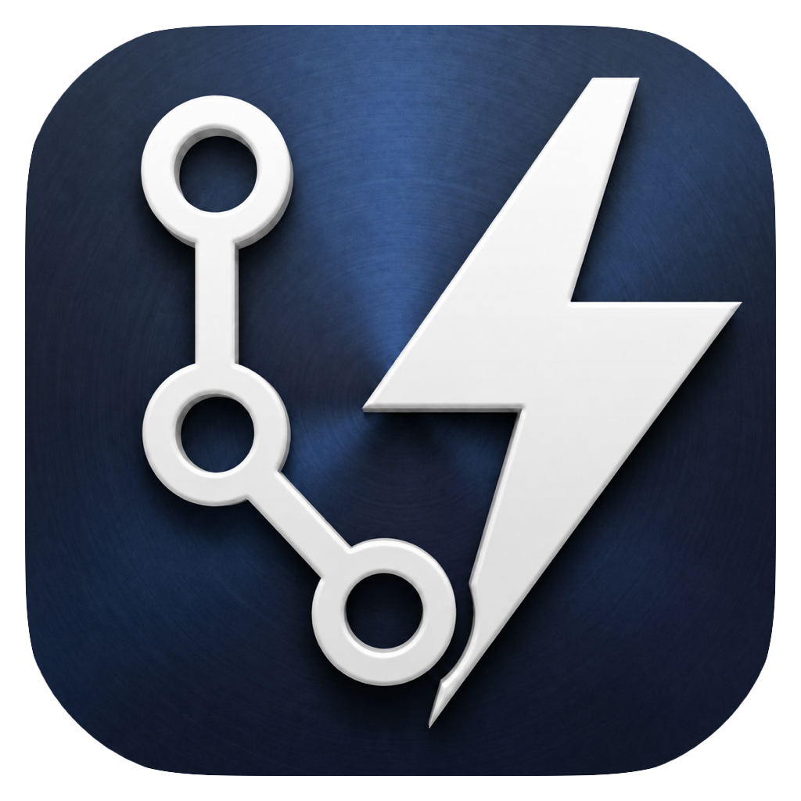

<p align="center">
  
</p>

<h1 align="center">VersionDock</h1>

<p align="center">
  <strong>专为 VS Code 打造的高效 Git 与 SVN 版本控制工作台</strong>
</p>

<p align="center">
  <a href="https://github.com/chenqinru/VersionDock/actions/workflows/ci.yml"></a>
  <a href="https://marketplace.visualstudio.com/items?itemName=chenqinru.versiondock"></a>
  <a href="https://marketplace.visualstudio.com/items?itemName=chenqinru.versiondock"></a>
  <a href="https://github.com/chenqinru/VersionDock/releases"></a>
  <a href="LICENSE"></a>
</p>

<p align="center">
  <a href="README.md"><strong>English</strong></a> | <a href="README_zh.md"><strong>简体中文</strong></a>
</p>

VersionDock 为 Visual Studio Code 带来了媲美专业 IDE（如 JetBrains/PhpStorm）的版本控制工作流：包含直观的提交面板、带分支拓扑图谱的日志面板、Git/SVN 多仓库混合管理、变更列表（Changelists）、补丁搁置（Shelf）、代码暂存（Stash）、三栏合并冲突编辑器以及内置 AI 提交信息生成。

当打开的工作区包含 Git 仓库或 SVN 工作副本时，VersionDock 会自动激活。


## ✨ 核心特性

### 📝 提交面板（Commit Panel）

- **暂存/未暂存文件列表**：支持树状（Tree）和扁平（Flat）两种视图，状态自动持久化。
- **文件差异即时预览**：在面板内即可直接查看选中文件的 Diff。
- **文件快捷操作**：打开文件、回滚更改、删除文件、添加到 `.gitignore`。
- **精细化提交控制**：支持仅提交选中文件或提交所有已暂存的更改。
- **SVN 无缝支持**：由于 SVN 没有 Git 暂存区概念，面板自动以勾选的文件作为提交目标。
- **组合提交按钮**：支持一键 **Commit** / **Commit & Push**，以及通过下拉菜单进行 **Amend** / **Amend & Push**。
- **智能 AI 提交生成**：原生接入 GitHub Copilot，并支持 OpenAI、Claude、Gemini 以及任何自定义 OpenAI 兼容端点。
- **流式打字机效果**：生成的提交信息以打字机动效平滑输入，提供可自定义的 Prompt 模板。

#### 视图模式

首次安装时可通过 QuickPick 选择您偏好的视图模式，也可以随时在 VS Code 设置中的 `versiondock.changesViewMode` 切换：

| 模式 | 说明 |
|:--|:--|
| **Simplified** | 按仓库分组展示暂存和未暂存分区（默认模式） |
| **Changelists** | PhpStorm 风格的命名变更列表，支持在列表间自由拖拽与移动文件 |
| **VS Code** | 原生风格的暂存/未暂存分区，提供内联暂存与取消暂存按钮 |


#### 变更列表（Changelists）

- 支持从右键菜单创建、重命名和删除命名变更列表。
- 支持在变更列表之间直接拖拽文件，或使用右键菜单重新分配。
- 默认变更列表（Default）和未跟踪文件列表（Unversioned Files）始终常驻。

### 🚀 同步管理（Sync Tab）

- 统一展示各仓库的待推送与待拉取提交，包含未关联 upstream 的分支。
- 支持按待推送、待拉取方向筛选，并检查单次提交或聚合文件变更。
- 主操作根据实际差异自动切换为推送、拉取或同步，只有同时存在双向差异时才先拉取再推送。
- 支持撤销（Undo）未推送的 HEAD 提交，点击提交行可跳转到 Git Log 中的对应节点。

### 🗄️ 搁置与暂存（Shelve & Stash）

- **补丁搁置（Shelve）**：基于 Patch 的搁置系统，支持创建、完整/部分应用、删除以及检查差异。
- **原生 Git Stash**：列表浏览、应用、弹出、丢弃和差异预览。


### 📜 Git 日志与图谱（Git Log Panel）

- **拓扑图谱**：清晰美观的分支与合并泳道渲染。
- **SVN 历史**：展示线性修订历史，包含版本号、作者、日期、日志及变更文件列表。
- **分支侧边栏**：本地分支、远程分支、Tag 标签分类浏览；单仓库自动精简展示。
- **多维度筛选**：支持按文本、作者、分支、日期范围和仓库进行极速过滤。
- **提交详情与 AI 解释**：深度解析单次或聚合提交，支持 AI 结构化总结变更内容。
- **作者头像解析**：自动解析 GitHub noreply 邮箱头像、Gravatar 头像及首字母彩色占位符。
- **完整分支操作**：检出、抓取、拉取、推送、合并、变基、删除、重命名、比较和创建分支。


### 🌿 分支状态栏与多账户管理

- **状态栏分支项**：实时显示当前分支名、脏状态、ahead/behind 计数，点击唤出全局 Git/SVN 快捷菜单。
- **身份多 Profile 切换**：可为不同工作区配置专属的 Git 提交身份（用户名与邮箱），提交时无缝注入，不污染全局 `~/.gitconfig`。
- **SVN 账号安全管理**：管理 SVN 认证凭据，支持连接测试与凭据重置。

### 🔍 行内代码追溯（Git Blame）

- **行内 Blame 列**：在编辑器中直观展示每行代码的作者、相对时间与提交摘要。
- **行尾幽灵文本（Ghost Text）**：光标移动时光标所在行末自动渲染提交元数据。
- 点击直接跳转到 Git Log 对应提交。

### ⚔️ 三栏合并编辑器（3-Way Merge Editor）

- 专为冲突解决打造的三栏编辑器（本地修改、冲突标记、最终合并结果）。
- 快捷接受当前/传入更改、保存并自动标记冲突为已解决（Git stage / SVN resolve）。

---

## 📋 环境要求

- Visual Studio Code `1.85.0` 或更高版本。
- 本地环境中已安装 **Git**。
- SVN 功能需要系统 `PATH` 中包含 **`svn`** 命令行工具（推荐 SVN 1.14+）。
- 纯净运行：运行时不依赖多余外部重量级依赖，轻量快速。

---

## 📦 安装与使用

### 从 VS Code 插件市场安装

在 VS Code 扩展面板中搜索 **`VersionDock`** 并点击安装。

### 从 VSIX 文件安装

```bash
code --install-extension versiondock-3.6.0.vsix
```

### 本地开发与调试

```bash
# 安装依赖
npm install

# 监听编译
npm run watch

# 在 VS Code 中按 F5 启动 Extension Development Host
```

---

## 🌐 生态系统

如果您需要一个无需打开 VS Code 即可独立运行的高性能桌面端应用：

👉 欢迎体验 [**VersionDock Desktop**](https://github.com/chenqinru/VersionDockDesktop) —— 基于 Tauri 2、Rust 和 React 18 打造的独立 Git/SVN 桌面工作台。

---

## 🤝 参与贡献

非常欢迎社区贡献！请在参与前查阅我们的 [**贡献指南**](CONTRIBUTING.md) 和 [**行为准则**](CODE_OF_CONDUCT.md)。

- 🐛 发现 Bug？[提交 Bug 报告](https://github.com/chenqinru/VersionDock/issues/new?template=bug_report.yml)
- 💡 提出新想法？[提交功能建议](https://github.com/chenqinru/VersionDock/issues/new?template=feature_request.yml)
- 💬 交流讨论？[访问 GitHub Discussions](https://github.com/chenqinru/VersionDock/discussions)

## 🔒 安全政策

如发现安全漏洞，请阅读 [安全政策（SECURITY.md）](SECURITY.md) 并通过私密渠道报告。

## 📄 开源协议

本项目采用 [GNU General Public License v3.0](LICENSE) 协议开源。
